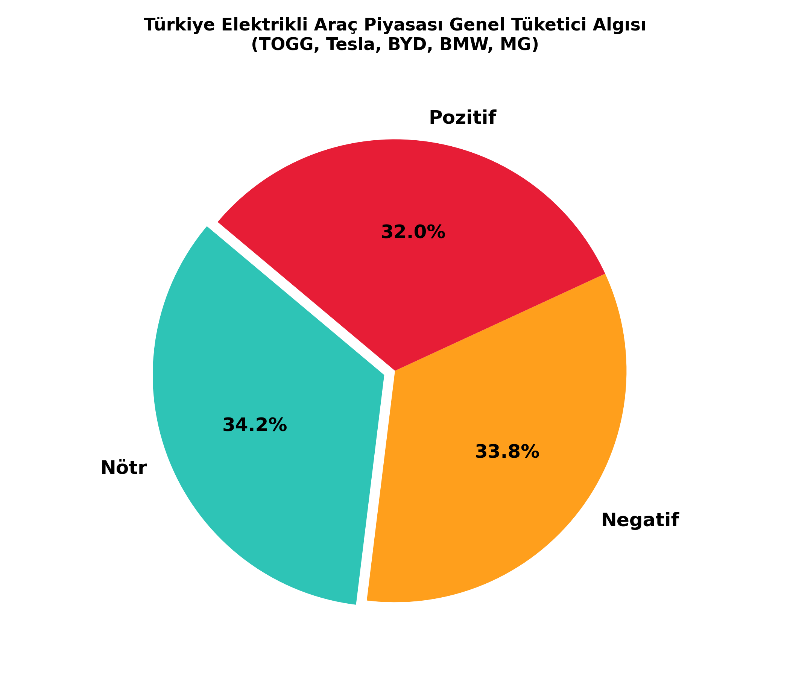

# birgul
Türkiye Geneli Elektrikli Araç Tüketici Algısı ve Duygu Analizi Projesi
Bu proje, Türkiye otomotiv pazarında faaliyet gösteren öncü elektrikli araç markalarına (TOGG, Tesla, BYD, BMW, MG) yönelik tüketici algısını ve eğilimlerini ölçmek amacıyla geliştirilmiş bir **Doğal Dil İşleme (NLP) ve Duygu Analizi** çalışmasıdır.

---

## 📈 Proje Bulguları ve Metrikler

### 📝 Kelime Sayımı Algoritması Raporu
Arka planda çalışan kelime sayma algoritması, kullanıcı yorumlarındaki duygu eğilimlerine göre metinleri derinlemesine taramış ve şu sonuçları üretmiştir:
* **Nötr Yorumlar:** Toplam **2,774 kelime** taranmıştır.
* **Negatif Yorumlar:** Toplam **2,673 kelime** taranmıştır.
* **Pozitif Yorumlar:** Toplam **2,127 kelime** taranmıştır.

### 📊 Dağılım Oranları
* **Nötr Eğilim Oranı:** %34.2
* **Negatif Eğilim Oranı:** %33.8
* **Pozitif Eğilim Oranı:** %32.0

---

## 🖼️ Analiz Grafiği

Sayfaya yüklediğimiz analiz çıktısı aşağıda yer almaktadır:

---

## 🛠️ Kullanılan Teknolojiler
* **Python 3**
* **Pandas** (Veri madenciliği ve manipülasyonu)
* **Matplotlib** (Veri görselleştirme)
* **Random** (Olasılıksal veri dağıtımı simülasyonu)
